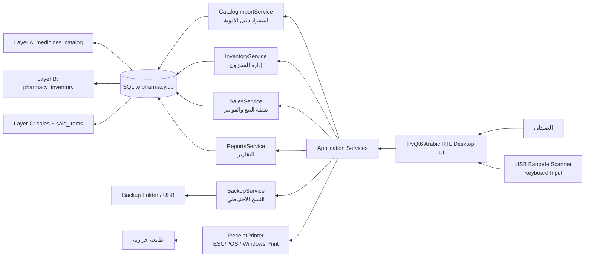
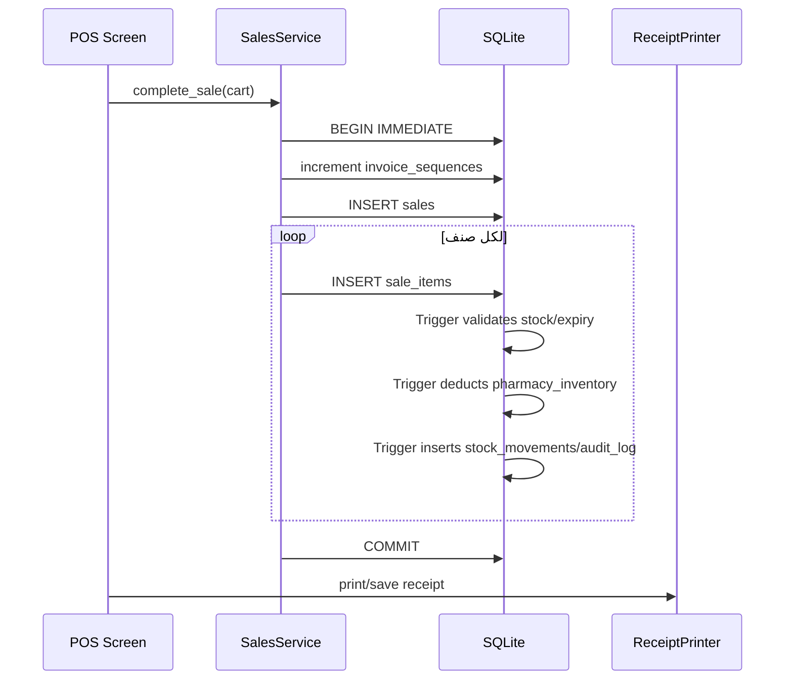

# 02 - Application Architecture

التطبيق Desktop محلي بالكامل على جهاز Windows واحد، ولا يحتاج إلى إنترنت في العمليات الأساسية.

## التقنية المختارة

تم اختيار **Python + PyQt6 + SQLite** لأنها أبسط للتشغيل المحلي، وأسهل للنسخ الاحتياطي، ولا تحتاج إلى خادم أو Cloud.

## الرسم المعماري



## المجلدات الرئيسية

```text
db/
  schema.sql              # قاعدة البيانات والجداول والـ triggers
  sample_data.sql          # بيانات تجريبية
src/pharmacy_app/
  database.py              # تهيئة SQLite والمعاملات
  catalog_import.py        # استيراد دليل الأدوية
  inventory.py             # إضافة وتعديل المخزون
  sales.py                 # POS والفواتير وخصم المخزون
  reports.py               # التقارير
  backup.py                # النسخ الاحتياطي والاسترجاع
  receipt_printer.py       # إيصالات حرارية أو ملف نصي
  ui/main_window.py        # واجهة عربية RTL
scripts/
  init_db.py
  load_sample_data.py
  run_desktop.py
docs/
  ملفات التوثيق ودليل المستخدم
```

## مسار البيانات على Windows

افتراضياً يتم حفظ قاعدة البيانات في:

```text
%APPDATA%\LocalPharmacy\pharmacy.db
```

والنسخ الاحتياطية في:

```text
%APPDATA%\LocalPharmacy\backups\
```

يمكن تغيير المسار بمتغيرات البيئة:

```text
PHARMACY_DB_PATH
PHARMACY_DATA_DIR
PHARMACY_BACKUP_DIR
```

## تدفق عملية البيع



## قواعد السلامة

- لا بيع بدون مخزون فعلي إلا `one_off` اختياري وموسوم بوضوح.
- لا بيع لدواء منتهي الصلاحية.
- لا كمية سالبة.
- لا حذف نهائي للجداول الأساسية.
- كل عملية بيع في Transaction واحدة.
- سجل تدقيق لكل العمليات الحساسة.

